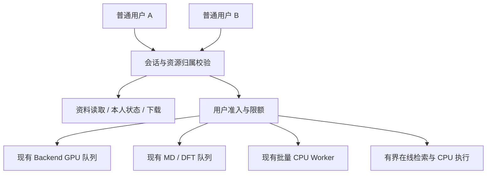

# 普通用户账号 MVP：双用户隔离、数据库与任务协调

日期：2026-09-10。范围：当前工作树，包含新增批量正向聚合及结构工作台重构。本文为静态分析和设计草案，没有执行数据库迁移或修改业务实现；功能开关及运行环境需实施时核验。

状态：设计草案，尚未实现。本文是[完整用户登录与工作空间隔离分析](user-auth-and-isolation-analysis.md)的双普通账号最小范围方案：先按 `owner_user_id` 隔离个人资源，不引入团队工作空间。完整方案保留更长期的空间／成员权限方向，两者不是同时生效的数据库设计；扩展到团队空间前需另行确定迁移与权限合约。文中“当前”均指上述分析时点，不代表后续代码或环境已完成这些能力。

## 1. MVP 结论

先定义两个同等权限的普通账号 A、B：共享平台认可的只读科学资料，各自拥有私人输入、历史、实验记录、任务和文件。账号由运维开通，提供登录、退出、改密、禁用及受控重置；第一期不引入组织、团队共享、复杂角色或公开注册。

建议最小数据结构为 2 张身份表 auth.users、auth.sessions，加现有 7 张私有业务主表的 owner_user_id；推荐增加 1 张审计表，但它不承担授权判断。暂不建设统一 task_registry 或复制已有领域任务表。

任务方面需要补“用户准入、有限排队、资源上限、失败释放”的协调能力。现有各类执行器和 Worker 可以继续承担执行；两个普通用户并发使用本身不要求新建独立通用编排服务。

MVP 采用每类资源各自有限队列、相同用户较小额度、保守执行并发。用户可以同时在线和提交任务，是否同时执行取决于 CPU/GPU/外部服务容量。不要把账号数量直接映射为 GPU 执行并发。

OpenScience 的文件/命令工具是独立边界，建议暂不向普通账号开放，同时限制其直接入口。若必须首发开放，它自己的账号、会话、文件及执行隔离就是额外必做范围。

## 2. A、B 两个用户的信息边界

| 信息 | A、B 的可见性 | 保存与隔离方案 |
|---|---|---|
| 平台聚合物、公共文献、公共配方、静态 DFT、导入实验资料 | 经确认属于平台共享资料后，两人均可只读 | 保留现有共享表，不复制数据库 |
| 模型权重、算法、规则、单位、性质选项、MD 协议、示例模板 | 共享 | 保留全局只读资产和版本缓存 |
| 登录名、密码摘要、Cookie、会话和个人账号信息 | 各自独立 | auth.users/sessions；普通用户只访问自己的账号资料 |
| 查询词、SMILES、KET 布局、上传图片、目标性质和筛选条件 | 私有 | 当前操作可以仅放页面内存；进入历史或任务后跟随其 owner |
| 即时预测、单次聚合、结构相似性、逆合成结果 | 私有 | 本次响应只返回给调用者；无需仅因登录新增结果保存表 |
| 在线知识查询历史、论文抽取结果及清空/删除范围 | 私有 | online_knowledge.history/jobs 按用户查询和修改 |
| 用户录入的实验样品、测量值、仪器、备注和统计 | 私有 | lab.sample_measurements 按用户；operator 仍是业务字段 |
| MD/DFT/生成/逆向设计/批量聚合任务 | 私有 | 提交时绑定用户，状态/结果/取消/删除均按 owner 授权 |
| 批量聚合原始 A/B 文件、名称、编号、额外列、sheet、映射、预检错误 | 私有 | polymerization_batch.imports 与 jobs 分别拥有 owner |
| 轨迹、ZIP、XLSX、错误 CSV、原始来源和候选列表 | 私有 | 跟随父任务权限；直接下载 URL 也必须鉴权 |
| AI 对话、缩略图、发送页面内容的同意 | 私有 | MVP 可继续本地保存，按账号分区，退出清敏感内容 |
| 草稿、最近批量任务、PDF 文件名、实验 Demo 输入 | 私有 | 分用户本地键或退出清理；不为 Demo 自动新增服务端表 |
| 页码、抽屉开关、选中行、3D 视角、临时错误 | 当前页面状态 | 退出/换号时重建即可 |
| 他人的任务标题、材料、文件名、参数、结果和错误详情 | 不可见 | 不因共享队列而展示这些信息 |
| 系统是否繁忙、自己的任务等待资源 | 可显示最低必要信息 | 调度可观察全局；普通界面只看自己的任务和粗粒度运行状态 |
| 平台供应商密钥、数据库配置、Worker 地址、运维能力 | 普通用户不可读取或管理 | 服务端配置和独立运维身份 |

最简单的规则是“平台公共资料可共同读取，私人记录满足 owner_user_id = 当前登录用户”。同一材料、同一 SMILES、相同文件内容或者相同幂等键，都不能成为跨用户共享私人记录的依据。

这里的隔离是网站账号之间的逻辑权限。若要求彼此不信任的外部客户连宿主机管理员、运行环境和物理缓存都无法接触对方数据，则需要更强部署隔离，超出这版双普通账号 MVP。

## 3. 两种并发场景必须分开

### 3.1 两个独立浏览器或浏览器配置

A、B 各自持有会话，可以同时操作。主要边界在服务器：B 不得用 A 的 job_id、import_id、history_id 或下载链接读取数据，也不得操作 A 的资源。数据库连接、线程池和模型对象可以共享，但用户请求及其结果不能存进未分用户的全局业务状态。

### 3.2 同一浏览器退出 A 后登录 B

页面和浏览器存储也要清理，否则后端虽然拒绝读取 A，前端仍可能展示已经缓存的 A 数据。当前批量功能使用固定键记录最近 20 个任务，无 URL 参数时自动恢复第一条，见 [usePolymerizationBatchJob.ts](../frontend/src/hooks/usePolymerizationBatchJob.ts)。

建议退出时撤销服务端会话，广播账号变化，终止 SSE/轮询/请求，销毁私人页面树、画板、缓存、预览及 object URL，清理私人持久内容，然后进入登录页。旧请求返回时，若所属会话代次已改变，丢弃回包。

普通同源 Cookie 在同一浏览器配置的标签页之间共享；MVP 不承诺在两个普通标签页分别保持 A/B 两套独立账号。换号时所有标签同步失效。并行测试两账号应使用独立浏览器配置或隔离的浏览上下文。

结构工作台已经改为 App 生命周期内的 StructureWorkspace，含 SMILES/KET/草稿/异步状态；可以在换号时重新创建，无需为此建“画板表”。见 [useStructureWorkspace.ts](../frontend/src/hooks/useStructureWorkspace.ts)。

## 4. 新增数据库表

### 4.1 auth.users：普通账号

| 字段 | 类型建议 | 用途 |
|---|---|---|
| id | uuid，主键 | 稳定用户 ID，由服务端生成；不是用户名 |
| username | varchar(64)，规范化且唯一 | 登录名；显示名称另存，避免名称修改影响归属 |
| display_name | varchar(128) | 页面显示名，不参与权限判断 |
| password_hash | text | 成熟密码哈希实现的结果，例如 Argon2id；不存明文 |
| status | text：active/disabled | 禁用账号立即拒绝后续用户请求 |
| must_change_password | boolean | 运维初始化或受控重置后要求改密 |
| created_at / updated_at | timestamptz | 账号生命周期 |
| password_changed_at | timestamptz | 密码管理记录 |

无需为了两个同权限账号引入 roles、permissions、organizations、workspace_memberships。账号开通/禁用/重置通过受控运维入口完成；不能将这些操作暴露为任意登录用户可调用的 API。

### 4.2 auth.sessions：可撤销登录会话

| 字段 | 类型建议 | 用途 |
|---|---|---|
| id | uuid，主键 | 会话记录 ID，不是浏览器中的登录秘密 |
| user_id | uuid，外键 | 所属账号 |
| token_hash | bytea，唯一 | 高熵随机会话令牌的 SHA-256 摘要；原令牌仅进入 Cookie |
| created_at | timestamptz | 会话创建时间 |
| last_seen_at | timestamptz | 空闲过期判断；更新要节流，不随每次任务轮询落库 |
| expires_at | timestamptz | 绝对到期时间 |
| revoked_at | timestamptz，可空 | 退出/改密/禁用后的撤销时间 |

Cookie 采用 HttpOnly、Secure 和明确 SameSite；配套绑定会话的 CSRF 验证。受控改密/重置应撤销其他旧会话。每次请求同时检查会话有效和 users.status；不能只在登录时检查一次账号状态。原则依据见 [OWASP 会话管理](https://cheatsheetseries.owasp.org/cheatsheets/Session_Management_Cheat_Sheet.html) 和 [密码存储](https://cheatsheetseries.owasp.org/cheatsheets/Password_Storage_Cheat_Sheet.html)。

### 4.3 建表草案

以下只表达目标结构，不是可直接应用到现有环境的正式迁移；UUID 由应用产生，不要求新增数据库扩展。实际迁移编号、校验和、运行角色、CSRF 实现和回填需单独落实。

```sql
CREATE SCHEMA auth;

CREATE TABLE auth.users (
    id uuid PRIMARY KEY,
    username varchar(64) NOT NULL UNIQUE,
    display_name varchar(128) NOT NULL,
    password_hash text NOT NULL,
    status text NOT NULL DEFAULT 'active'
        CHECK (status IN ('active', 'disabled')),
    must_change_password boolean NOT NULL DEFAULT false,
    created_at timestamptz NOT NULL DEFAULT now(),
    updated_at timestamptz NOT NULL DEFAULT now(),
    password_changed_at timestamptz NOT NULL DEFAULT now(),
    CHECK (username = lower(btrim(username)) AND length(username) > 0)
);

CREATE TABLE auth.sessions (
    id uuid PRIMARY KEY,
    user_id uuid NOT NULL REFERENCES auth.users(id) ON DELETE RESTRICT,
    token_hash bytea NOT NULL UNIQUE CHECK (octet_length(token_hash) = 32),
    created_at timestamptz NOT NULL DEFAULT now(),
    last_seen_at timestamptz NOT NULL DEFAULT now(),
    expires_at timestamptz NOT NULL,
    revoked_at timestamptz,
    CHECK (expires_at > created_at)
);

CREATE INDEX auth_sessions_user_active
    ON auth.sessions(user_id, expires_at)
    WHERE revoked_at IS NULL;
CREATE INDEX auth_sessions_expiry ON auth.sessions(expires_at);
```

账号第一期采用禁用而非物理删除，业务外键使用 RESTRICT，避免删除账号时意外级联删除科研记录和结果。历史无主数据可以由专门的禁用归档账号承接，并明确这是“来源不明的历史资料”，不伪称其为实际科研创建者。

推荐增加 auth.audit_events：id、actor_user_id、action、resource_type、resource_id、outcome、request_id、created_at，以及受限的错误码/元数据。它记录登录、取消/删除、下载和账号维护，不存密码、令牌或完整私人科研输入。若已有满足需求的受控审计日志，可先复用，不为两账号再建立完整审计平台。

## 5. 现有表如何调整

### 5.1 七张私有主表

| 表 | 新增/修改 | 所有用户请求都要覆盖 |
|---|---|---|
| online_knowledge.history | owner_user_id；唯一键改为 owner + material + mode | 列表、单项删除、清空、读取历史内容 |
| online_knowledge.jobs | owner_user_id | 创建、状态、结果、后台回写归属 |
| lab.sample_measurements | owner_user_id；sample_id 改为用户内唯一 | 录入、分页、总数、各项统计 |
| md.monomer_md_jobs | owner_user_id | 创建、历史、详情、轨迹、取消、删记录/产物 |
| monomer_dft.jobs | owner_user_id；幂等键改为 owner + idempotency_key | 创建、详情、历史、取消、单文件/bundle、删除 |
| polymerization_batch.imports | owner_user_id | 上传后的预览、映射、预检修订、提交时的引用 |
| polymerization_batch.jobs | owner_user_id；幂等键改为 owner + idempotency_key | 创建、状态、候选分页、取消、文件、个人历史 |

这些表记录同一用户的私人业务。同库时 owner_user_id 使用 uuid NOT NULL REFERENCES auth.users(id) ON DELETE RESTRICT，历史迁移先允许空值再回填收紧，独立 Lab 数据库按后述例外处理。owner 从验证后的会话产生，不接受请求体里声明的 user_id 作为权限依据。MVP 不提供普通用户转移 owner 的接口。

示例：A、B 都能使用样品编号 SAMPLE-001，因为约束变为 (owner_user_id, sample_id)。同一个人重复编号仍按当前业务规则返回冲突。在线历史按用户去重后，同一用户重复搜索是否覆盖仍保持现有语义；“保留每次搜索”是另一个产品改动。

常用索引优先包含 owner_user_id 和实际排序列，例如任务的 (owner_user_id, created_at DESC, job_id)，实验记录的 (owner_user_id, collection_time DESC, id)，并按真实主键名称调整。活跃数准入可用 (owner_user_id, status) 或匹配活跃状态的部分索引。

### 5.2 子表继承父任务权限

monomer_dft.job_attempts、monomer_dft.artifacts、polymerization_batch.chunks 可通过父任务关联判断用户，不必重复存 owner。产物清单、结果 JSON、文件目录同样继承父任务归属。

查询子资源时同时验证“父任务属于当前用户”和“子资源属于该父任务”；不能先凭 artifact_id 单独读取，再依赖前端已打开某个任务。服务端写子表时也保持这种关联。

### 5.3 批量 import 与 job 的特殊生命周期

目前创建任务时会把预检和原始文件复制到任务目录，导入记录可以较早过期删除，任务结果另按保留期存在。因此 jobs.import_id 当前是溯源字段，没有普通外键。

MVP 应在创建事务中按 import_id + 当前 owner 锁定并验证导入，校验 preview_revision，固定输入快照，再创建同 owner 的任务。不能允许 B 拿 A 的 import_id 创建属于 B 的任务。

不要直接给 import_id 加 ON DELETE CASCADE：这会让导入到期误删任务；RESTRICT 则会阻塞当前导入清理。若希望数据库强外键，先改成保留轻量导入墓碑，再设计文件清理；这不属于账号 MVP 必需。见 [任务快照](../backend/app/services/polymerization_batch/service.py)、[独立过期清理](../backend/app/services/polymerization_batch/worker.py)。

### 5.4 不需要加用户字段的表与状态

平台共享底库、只读模型注册、共享 lab.test_projects 测试字典、Worker 心跳和平台部署控制保持系统级。lab.test_projects 表示 Tg/Rg 等测试类别，不是研究团队项目。

条件生成、PolyTAO 和 Tg 逆向设计目前在内存中：先在任务对象加入 owner_user_id，并保护所有读取/动作。当前结构画板、即时预测、对话和 Demo 本地数据无需为了登录全部落库。

## 6. 后端访问、数据库与历史迁移

用户 API 的基本流程为：读取 Cookie → 验证有效会话和启用账号 → 产生 CurrentUser → 仓储按 owner 查询/操作。没有身份时拒绝业务访问；私人资源不属于当前用户时返回统一不可见结果。普通账号不能修改全局快照或触发 GPU 恢复。

示意查询：

```sql
SELECT * FROM md.monomer_md_jobs
WHERE job_id = %(job_id)s AND owner_user_id = %(current_user_id)s;

DELETE FROM online_knowledge.history
WHERE owner_user_id = %(current_user_id)s;
```

幂等查找也必须先按 owner 范围进行。已有同用户同请求时可直接返回原任务，不重复占额度；别人的相同 key 必须视为独立提交。字段约束、查找与 ON CONFLICT 同步修改。

推荐在私有业务表增加 RLS 作为防遗漏措施，但实现路径仍需服务端仓储明确过滤。API 角色不得是超级用户或 BYPASSRLS，并优先使用非表所有者角色；表所有者通常也会绕过 RLS，如确需所有者访问，应评估 FORCE ROW LEVEL SECURITY，并以实际运行角色验证。事务中建立当前用户上下文，子表策略通过父表 owner 限制。不要把认证查会话的启动过程强行依赖于尚未确定的当前用户上下文，也不要把 auth.users 全表开放给普通查询路径。[PostgreSQL RLS 说明](https://www.postgresql.org/docs/16/ddl-rowsecurity.html)

系统调度、全局容量计数、Worker 回写和保留清理需要受限的服务身份访问全部相关任务；普通用户的历史/实验统计只访问本人。特别是 MD 当前 queue_position 的子查询会统计整个队列，不能一边套用户 RLS、一边假设它仍返回全局排位。MVP 可以显示“排队/等待资源”，不向用户返回他人的任务信息。系统队列计数使用专门的受控路径，避免只数本人而错误突破总容量。

实施前还需处理三项仓库约束：

1. lab_data_postgres_dsn 可不同于主库。若不同库，不能直接对主库 users 建跨库外键；MVP 优先确认能否共库，保留分库则设计可信用户引用校验和各库权限。
2. 实验数据每次请求的 ensure_schema 仍包含建表、播种和序列 setval。应移入正式迁移/初始化，把请求入口改成只检查 schema，避免最小权限账号执行 DDL，也避免 RLS 过滤后的 max(id) 参与重设全局序列。见 [lab_data_repository.py](../backend/app/services/lab_data_repository.py)。
3. 新归属列/索引/RLS 改变 DFT schema 指纹，须同步兼容与 preflight；迁移文件不能改写，当前新增 0016 也不能被覆盖。新增认证表、回填及审计写入需进入既有发布治理。

历史数据先备份、分类，再回填给可确认账号或受限归档账号；不能默认给 A 或 B，也不能把 NULL owner 当成公共。迁移完成后将私人主表 owner 收紧为 NOT NULL。过渡期控制所有写路径，禁止继续生成无主记录。

## 7. 要不要新建统一任务表

为了隔离 A/B，不需要统一任务表。现有 MD、DFT、在线知识、批量聚合已经有领域任务表，其执行状态、结果和租约仍由这些表负责。统一列表可以用只读聚合服务，按当前用户从各领域读取，再映射为共同展示结构。

例如展示字段为 type、id、title、display_status、created_at、progress、可用操作；操作时再调用对应领域接口重新授权。持久任务可用只读 UNION 视图或聚合查询，进程内任务从对应 manager 读取。不能仅凭统一列表里出现过某个 ID 就允许后续下载或取消。

新批量功能目前只有浏览器最近任务 ID，没有服务端个人任务列表。如果 MVP 要求换电脑登录后找到批量历史，可以给现有 jobs 增加按 owner 的列表接口，不必另建 task_registry。

| 需求 | 是否需要新增任务/调度表 |
|---|---|
| A/B 任务权限隔离 | 不需要，给现有任务归属即可 |
| 各模块“我的任务”或统一概览 | 不需要第二套可写任务状态，可以只读聚合 |
| 同类任务的用户活跃数限制 | 通常不需要，现有领域任务状态加事务锁即可 |
| 三类内存任务重启后仍有历史 | 需要为这些任务增加持久化事实源，但不必重建 MD/DFT/batch |
| 跨所有任务类型的严格每日预算、多实例原子额度 | 可增加资源预留/使用记录，明确幂等和结算 |
| 多节点持久分发、依赖 DAG 和跨步骤补偿 | 再评估通用持久队列/独立编排器 |

如果现在同时写领域 jobs 和 task_registry 两份 status，会产生领域成功而总表仍运行、总表存在而领域创建失败、清理后权限残留等一致性问题。通用 type + id 引用也无法直接对不同领域表建立一条普通外键。

未来确需统一索引时，应将其定义成可重建只读投影；需要可靠同步再引入事务 outbox/版本控制/对账。未来确需资源预留表时，可包含 owner_user_id、resource_class、job_type、job_id、reservation_state、执行尝试/租约标识及 created_at/released_at，建立任务与资源范围的唯一约束。首版按通道固定限额可以避免这部分工程量。

## 8. 现有任务执行机制

| 工作负载 | 当前代码机制 | 对两个用户 MVP 的判断 |
|---|---|---|
| 数据读取、任务轮询、下载鉴权 | Web/数据库请求 | 保持独立响应，不排在长计算后面 |
| 条件生成、PolyTAO、识图、GPU 逆合成 | Backend 内模型执行与全局 FIFO；默认 GPU 推理并发 1 | 沿用硬件上限；补用户身份和有限准入 |
| Tg 逆向设计 | 独立线程池，默认 1；任务字典缺显式容量/TTL | 补有限等待、用户限额、最大耗时和历史淘汰 |
| 单体 MD | 持久任务和独立 Worker；正式模式现有 1 执行 + 2 等待约束 | 在已有准入事务中增加用户限额，不另起用户专用 Worker |
| 单体 DFT | 持久任务、journal、单执行 dispatcher 和有限队列 | 按环境既有开关/执行合同接入 owner 授权，登录改造不自动改变启用状态 |
| 双表批量聚合 | PostgreSQL jobs/chunks + 单例 CPU Worker、分块/租约/恢复 | 已有可靠协调基础，不进 Backend GPU 队列 |
| 在线知识检索 | 作业入 PostgreSQL，但执行用 BackgroundTasks；每项搜索再开 4 线程 | 增加有限执行池/准入，不把“已入库”视为可靠后台调度 |
| 单次聚合 / 文件预检 | 单次聚合 limiter 1；批量预检 limiter 2、隔离子进程 | 沿用有界执行，并限制单用户同时上传/预检 |
| 性质预测 | async 路由中直接执行同步特征与预测计算 | 改为有界线程/适合的执行器，避免占住事件循环 |

这些是当前代码默认值/约束，不是现场容量测试结论。直接提高配置值不能替代 CPU、显存、模型运行时和科学协议的并发验收。

证据：[GPU 调度](../backend/app/services/gpu_runtime_registry.py)、[反向设计](../backend/app/services/reverse_design_jobs.py)、[预测同步调用](../backend/app/routers/predict.py)、[在线后台任务](../backend/app/routers/online_knowledge.py)。FastAPI 自身也区分进程内 BackgroundTasks 与需要多进程/多机器执行的重型后台任务，见 [官方说明](https://fastapi.tiangolo.com/tutorial/background-tasks/#caveat)。

## 9. 建议的轻量协调层

建议增加统一的 TaskAdmissionService（名称仅示意），复用各模块已有事务/锁。它统一检查用户有效性、用户限额、模块开关和全局容量，然后交给对应的领域队列执行；它自身不再维护第二个等待队列，不成为第二份任务状态。



### 9.1 第一版建议限额

以下是为两个账号给出的保守起点，应配置化并通过实测调整，不是当前实现或性能承诺。

| 类别 | 每用户建议上限 | 全局规则 |
|---|---|---|
| 长时间 GPU 生成任务 | 同一受限 GPU 通道最多 1 个未完成顶层任务 | 保持已验证的物理 GPU 并发；Backend 当前默认 1 |
| 正式 MD | 最多 1 个未完成任务 | 保留现有正式队列容量及执行约束 |
| DFT（该环境启用时） | 最多 1 个未完成任务 | 保留现有 Worker 单执行与等待容量 |
| 批量聚合 | 最多 1 个未完成任务 | 保留单例 CPU Worker 和原全局容量 |
| Tg 逆向设计 | 最多 1 个未完成任务 | 建议 1 执行，有限等待；补最大耗时和 TTL |
| 在线知识检索 | 最多 1 个活跃检索 | 可先允许两个用户各 1 个，前提是外部 provider 额度与本机容量允许 |
| 上传/预检 | 最多 1 个活跃预检，并限制暂存总量 | 保持现有全局预检并发 2；限制大小、总暂存数量和保留期 |
| 只读资料/任务轮询 | 不消耗长计算名额 | 独立请求速率/超时/分页与连接限制 |

“未完成”包括已排队、执行中和取消收尾中的任务；状态名称以各领域实际枚举为准。若不同模块共用同一个受限 GPU 通道，用户额度也应在该通道内合并，而不是每个模型各给用户一份额度。

顶层作业的用户准入额度与实际 GPU 执行槽是两个概念：先准入，不代表立即持有 GPU。不要在提交时占住物理 GPU 然后等队列，也不要让一个任务的内部多轮推理重复计算为多个用户任务。

对同步 GPU 小请求仍需用户频率/等待限制。若任务位已满，应明确返回可重试的繁忙结果或按现有有界队列等待，不通过无限创建线程“代替队列”。查询任务状态、退出登录等轻请求不应被同一重计算锁串行化。

### 9.2 原子准入与一致性

持久任务在短事务内执行：验证账号/资源归属 → 按固定顺序取现有全局容量锁与用户锁 → 查询本用户幂等 → 统计全局及用户未完成任务 → 插入领域任务 → 提交。对已有幂等任务的返回可以保留当前系统在排空/满额时仍允许重试读取的契约，但先完成身份与 owner 检查。

不能先 COUNT，再在另一个事务 INSERT，否则 A 的两个并发请求都可能认为还有一个名额。已有全局容量锁足以串行化相关提交时，不必重复增加用户锁；锁顺序要与现有发布排空/取消路径保持一致。不要持有事务等实际计算结束。

批量聚合已经用事务 advisory lock 做容量准入，领取分片用行锁和 SKIP LOCKED，可以直接扩展 owner 计数。[现有准入](../backend/app/services/polymerization_batch/repository.py)。PostgreSQL 文档明确 SKIP LOCKED 适合队列式消费，但它本身不保证用户公平或任务恰好执行一次，见 [SELECT 锁定语义](https://www.postgresql.org/docs/16/sql-select.html#SQL-FOR-UPDATE-SHARE)。

单 Backend 进程内任务，可以在共同的线程锁内检查并登记用户额度。多个 GPU 业务若共享额度，要使用同一个进程内准入对象，而非各建一个计数器。纯内存执行与持久状态不是一个事务，后续若跨多个 Backend 副本，必须迁移该计数/任务状态到共享权威，不能让每个副本各自放行一次。

跨任务类型严格总预算不是此版默认要求。例如 A 同时有一个 batch 和一个 MD，可以各自占不同通道名额；如果业务要求“无论类型每人总共只能一个任务”，就要增加跨域原子资源预留，或将所有顶层任务纳入一个可靠准入事实源，不能只在 UI 数当前列表。

### 9.3 取消、失败、重试与重启

- 同用户同请求幂等重试只占一次额度；数据库写入失败则事务回滚；向进程内执行器提交失败则撤回登记。
- 取消先验证 owner，再写意图。排队任务确认移除后释放；运行任务等执行器停止和资源清理确认后释放。
- 批量取消可能还要导出部分结果，cancelling 继续占用名额。不能用户点击取消后立刻允许再启动一份长计算。
- 心跳失联不等于物理资源已释放；恢复须保留租约/attempt/fencing 与旧执行器退出确认，防止重算时两个执行器同时占 GPU 或发布结果。
- 任务结束后的文件保留不继续占执行槽，但继续计入存储量。用户退出只结束浏览器会话，后台任务仍归原用户。
- 账号禁用后拒绝新提交和后续读取；建议待运行任务在派发前检查账号状态并取消，已运行任务可先安全收尾，再由运维按既定规则处置。不要通过删除用户行取消计算。
- 在线 BackgroundTasks 增加服务重启后的失联状态处理；现有内存生成任务继续明确“重启/淘汰后不可恢复”，除非另做持久化。

### 9.4 同一物理 GPU 的跨 Worker 协调

Backend 的 GpuRuntimeRegistry 只协调本进程内模型请求。它不能自动约束独立 MD/DFT Worker，也不能约束另一个 Backend 进程。

当前工作树的生产 Compose 已将 MONOMER_DFT_SUBMIT_ENABLED 设为 true，部署文档描述生产 MD/DFT 使用 GPU2 路径，且 DFT guard 的 observe 模式对外部 GPU 竞争只告警、不停止接单。文档明确这种方式仍可能发生显存压力、OOM 或超时。这里确认的是代码/部署合同，未探测实际生产状态；不能继续沿用上一轮基线中“DFT 仅隔离开发”的假设。见 [生产开关](../docker-compose.prod.yml)、[GPU 竞争与队列合同](deployment.md)。

若这些进程在同一物理 GPU 上运行，需要额外的跨进程资源边界：复用经过该环境验证的 Host Broker/资源租约，或固定设备分配/禁止冲突任务并发。不能因为每个服务各自并发为 1，就认定合计不会耗尽显存。

还要计算模型常驻显存；只禁止两个推理函数同时执行，并不自动腾出常驻模型占用的显存。并发放行必须符合实际容量，必要时保留已有运行时的卸载/独占机制或明确设备专用。

仓库中存在 Broker/MPS 能力，不代表当前所有环境已启用，现有 observe 也不能视作资源隔离已经完成。MVP 不应为了两个账号自动改变生产 GPU 划分；需要核验实际设备映射和已批准的执行路径。如果现场没有覆盖所有竞争者的安全准入，这部分协调必须补齐，不能延期为“以后上编排平台”。

## 10. 两个用户并行时的具体行为

| 场景 | 建议行为 |
|---|---|
| A 跑批量 CPU 聚合，B 查数据库 | 两者可以并行；B 的请求不进入批量执行锁 |
| A 跑批量 CPU 聚合，B 做 GPU 逆合成 | 在整机 CPU/内存/IO 预算内可以并行，不共用一个全站串行队列 |
| A、B 都提交正式 MD | 一人执行、一人进入现有队列；两人只看和操作自己的任务 |
| A 条件生成，B 做 GPU 逆合成 | 按共用 GPU 执行容量排队，不因用户不同自动同时占 GPU |
| A 连续提交十个 batch，B 提交一个 | A 达到本人未完成任务上限后拒绝后续新提交；B 仍可使用自己的额度，且仍受总容量限制 |
| A、B 都用相同样品编号或相同幂等键 | 两人记录独立；同一人的重试才复用自己的任务 |
| B 修改 URL 为 A 的 job/import/artifact | API 拒绝；不会先解析 A 的文件再判断权限 |
| A 点击取消后立即重提 | 取消收尾未完成时仍占额度，不能并行启动超额作业 |
| A 退出后 B 在原标签登录 | A 作业可继续；B 页面干净且不能访问 A 任务 |
| A 的大 batch 与 B 的小 batch | FIFO 下 B 等 A 完成；若产品要求交替进展，在 chunk 安全边界加入用户轮转 |

### 批量分块不等于已实现公平轮转

当前 claim 每次仍按 job.created_at 选择最早任务，再取其下一个 chunk，因此 A 的长任务往往持续占据单例 Worker。见 [repository.py](../backend/app/services/polymerization_batch/repository.py)。

最小可用策略是 FIFO + 每人一个未完成任务 + 最大耗时，给用户明确“排队”状态。它能防止 A 提前塞满整个队列，但不能保证 B 的短任务立即开始。

若确需改善交互，在一个 chunk 完成后按用户轮转，例如 A1 → B1 → A2 → B2，同时保持每个任务内部 classify → generate → export 的依赖顺序和各自文件/attempt 隔离。不同 chunk 耗时不同时，这只是轮转进展，不是精确 CPU 时间均分。可以在现有 jobs 增加 last_dispatched_at 或由受控调度状态记录轮转位置，无需另建工作流 DAG 表。

MD/DFT 不适合随意中断科学计算来轮转；没有安全 checkpoint 能力时以完整任务为调度单位。也不要在生成和推理的未验证位置任意抢占 GPU。第一期无需实现通用抢占式调度。

## 11. MVP 中必须顺手补齐的并发缺口

1. 反向设计：当前队列/历史没有明确上限，完整扫描关闭扫描行数及超时限制；补全局/每用户队列上限、运行最大耗时与终态 TTL。小线程池只能限制执行数，不能阻止无限积压。
2. 在线知识：入库后每项直接启动 BackgroundTasks，搜索器再开 4 线程；限制整个检索任务和外部服务并发，避免两个用户连续点击产生大量线程/API 调用。
3. 性质预测：async 路由直接同步计算，应转到有界执行器，避免 A 的 CPU 计算卡住 B 的轮询和登录响应；线程数增加不等于 CPU 无限扩容。
4. 供应商默认密钥：当前请求仍能影响 base_url，服务端默认凭证必须绑定批准的 provider/endpoint；否则普通账号可借平台凭证发往非预期目标。
5. 下载和预检：批量文件通过普通链接下载，下载路由必须支持相同会话和 owner 授权；先查权限再开文件/占下载槽。上传总量也要限制，避免不建任务只上传文件耗尽磁盘。

## 12. 实施包、验收与升级门槛

| 次序 | 交付内容 | 完成标准 |
|---|---|---|
| 1 | 固定 MVP 范围、共享/私人数据分类、旧记录归属、Agent 入口范围 | 每个业务资源都有明确规则 |
| 2 | 两张身份表、账号维护入口、登录/退出/改密、Cookie/CSRF | A/B 可以独立登录，禁用和退出使旧会话失效 |
| 3 | 七张主表、内存任务、文件下载、全部仓储路径的 owner 授权 | 两用户修改 ID 不能跨范围访问或操作 |
| 4 | 前端切号、旧存储处理、缓存/请求/SSE 清理 | B 不恢复 A 的私人内容 |
| 5 | 复用队列，加入原子用户准入、有限排队和资源约束 | 两人可同时使用，单人不能无限塞满队列 |
| 6 | 历史迁移、DFT 指纹、Lab 初始化、发布/回滚和并发验收 | 数据归属可解释，既有运行/迁移门禁正常 |

验收至少包括：

- 两浏览器 A/B 同时操作，A 的历史/实验/任务/文件不进入 B 的列表、总数和结果。
- B 用 A 的 import_id 做预检和提交，被拒绝；原文件、错误行、预览及下载均不可读。
- 两人相同编号/幂等键互不冲突；同用户并发重试只创建一份任务且只占一个额度。
- A 同时两个新请求不能越过每用户限额；A 填满自身额度后 B 仍按全局余量准入。
- A 运算时 B 的健康查询/任务轮询仍可响应；共享 GPU 不超额启动，CPU batch 可独立推进。
- 取消、超时、Worker 异常、重启和重复完成事件不提前或重复释放资源。
- A 退出后 B 登录同浏览器，不出现 A 的画板、图片、历史、最近任务和旧回包；其他标签同步处理。
- 旧账号禁用后不能继续请求；后台任务仍有原 owner，终止/收尾政策可验证。
- 系统容量统计使用受控全局视图，私人业务统计按 owner，不因 RLS 误判系统空闲。
- 旧数据回填、导入过期不误删任务、DFT readiness、独立实验库路径和回滚均通过隔离数据库演练。

当出现跨机器扩容、多个 Backend 副本、所有任务共享预算、多步骤依赖链（生成 → 预测 → 筛选 → DFT → MD）、长期重试/补偿或跨资源优先级时，再考虑持久准入表、可靠任务分发和独立编排服务。应根据这些能力需求升级，不以用户数量达到两个为触发条件。

当前最合适的建设规模是“2 张身份表 + 7 张业务主表归属 + 内存任务归属 + 前端清理 + 复用现有队列的轻量准入”，并把跨 Worker 同 GPU 的安全边界作为部署验收项。
